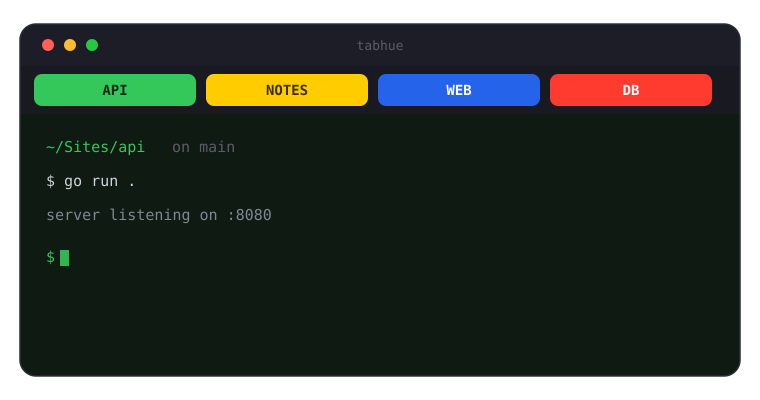

<div align="center">

# tabhue

**Color your terminal tab by the project you are in.**

A tiny, dependency-free CLI that gives every project an instant, recognizable tab.

[](LICENSE)

[](https://goreportcard.com/report/github.com/bunlongheng/tabhue)




</div>

## Why

When you juggle a dozen terminal tabs, they all look the same. `tabhue` colors each
tab by its project directory, so you find the right one at a glance.

## Features

- Per-project tab color, title, and icon
- Single static binary, zero dependencies
- Instant: pure terminal escape codes, no daemon
- Walks up parent directories, so nested folders match
- One-line shell hook to auto-color on `cd`

## Install

```bash
go install github.com/bunlongheng/tabhue@latest
```

Or build from source:

```bash
git clone https://github.com/bunlongheng/tabhue
cd tabhue && go build -o tabhue .
```

## Quick start

```bash
tabhue init                            # writes a sample ~/.config/tabhue/config.json
cd ~/Sites/yourproject
tabhue apply                           # colors the current tab
```

### Auto-color on cd (zsh)

```zsh
autoload -U add-zsh-hook
add-zsh-hook chpwd 'tabhue apply'
tabhue apply        # also color a freshly opened tab
```

## Configuration

`~/.config/tabhue/config.json` (override the path with `$TABHUE_CONFIG`):

```json
{
  "projects": [
    { "path": "/Users/you/Sites/api", "label": "API", "color": "#34C759", "icon": "A" }
  ]
}
```

`label` and `icon` are optional (label defaults to the uppercased folder name). The
deepest matching `path` wins, so nested projects work.

## Commands

| Command | Description |
|---|---|
| `tabhue apply [dir] [--bg]` | Color the tab for `dir` (default: current dir); `--bg` also tints the background |
| `tabhue list` | List configured projects |
| `tabhue init` | Write a sample config |
| `tabhue reset` | Clear the tab color and background |
| `tabhue version` | Print the version |

## How it works

`tabhue` emits OSC (Operating System Command) escape sequences:

- `OSC 6` sets the iTerm2 tab color (one sequence per channel)
- `OSC 11` sets the terminal background (with `--bg`, a 35% blend over near-black)
- `OSC 1` and `OSC 2` set the tab and window title

Tab color (`OSC 6`) is an iTerm2 extension; titles work in most terminals. A directory
with no match is a silent no-op, so it is safe to wire into a shell hook.

## License

[MIT](LICENSE)
